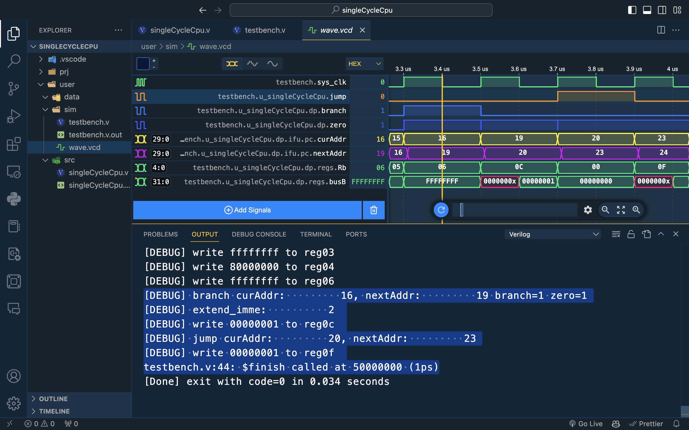
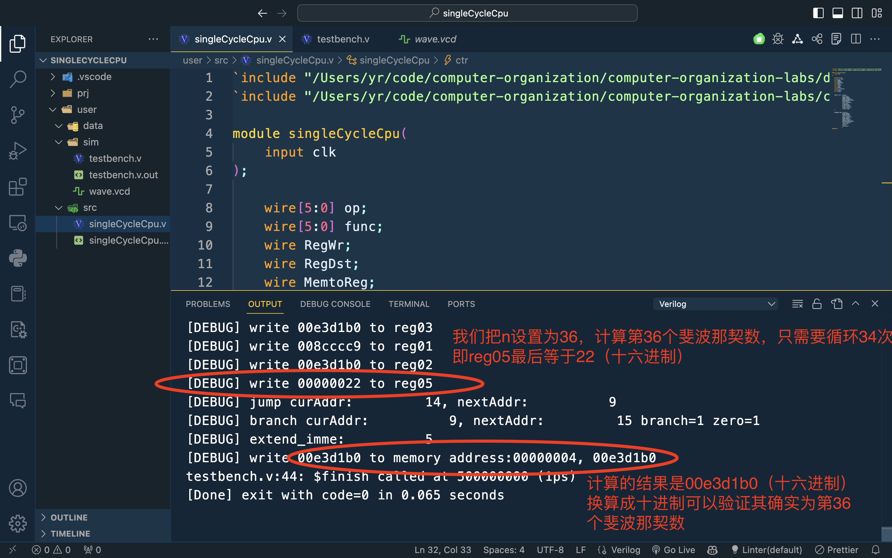
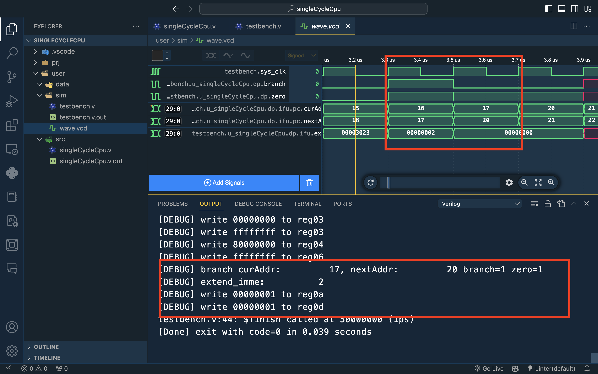
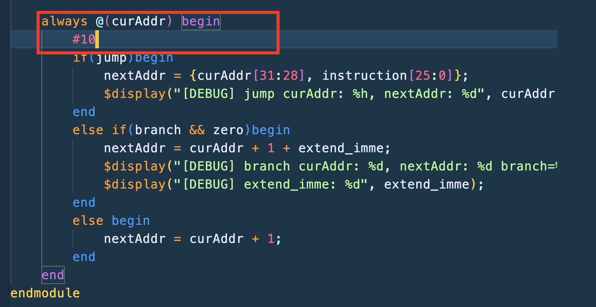
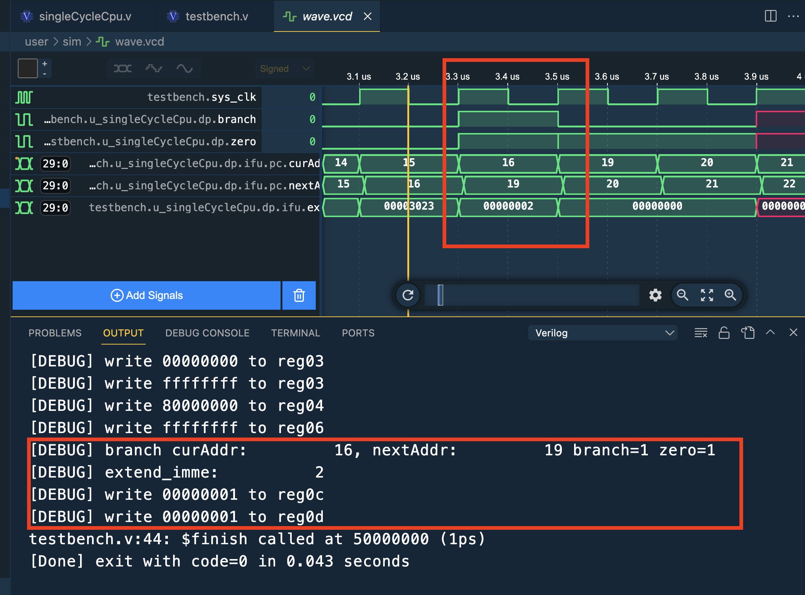

# computer-organization-labs

verilog实现

Quartuns2 9.0版本太过古早难用，加上丑陋，代码体验极差

解决方案：vscode + Verilog插件（Digital IDE，WaveTrace） + iverilog（跨平台轻量级verilog仿真器）


课程大作业实现单周期CPU， 按照教材实现11条指令

R-type:

add rd rs rt

sub rd rs rt

subu rd rs rt

slt rd rs rt

sltu rd rs rt

I-type:

ori rt rs imm16

addiu rt rs imm16

lw rt rs imm16

sw rt rs imm16

beq rt rs imm16

J-type

j target


指令高6位为OP字段，每一个寄存器号字段为5位，目标地址25位，立即数16位，Rtype指令末6位为func字段

| 指令 | add    | sub    | subu   | slt    | sltu   | ori    | addiu  | lw     | sw     | beq    | jump   |
| ---- | ------ | ------ | ------ | ------ | ------ | ------ | ------ | ------ | ------ | ------ | ------ |
| OP   | 000000 | 000000 | 000000 | 000000 | 000000 | 001101 | 001001 | 100011 | 101011 | 000100 | 000010 |
| func | 100000 | 100010 | 100011 | 101010 | 101011 | x      | x      | x      | x      | x      | x      |

数据存储器模块为256个8位宽寄存器构成，每次读出32位的数据，一共可以存 256 / 4 = 64个32位宽的数据

指令存储器为512个8位宽的寄存器构成，每次读一个32位的指令，一共可以存512 / 4 = 128 条 指令 （可以通过调节开辟的数组大小调节） 

设计时指令存储器按照大端方式存放指令数据，数据存储器按照小端方式存放数据（指令用大端存放，把指令写到文件时比较方便）

第0，1，2，3寄存器被初始化为0，数据存储器全部初始化为1

对于PC，为了让每次取指令都落在一个规整的周期里，设计时对currentPC不赋初值（高阻抗），对nextPC赋为0


## 指令测试

| 指令  | 测试 |
| ----- | ---- |
| add   | ✅    |
| sub   | ✅    |
| subu  | ✅    |
| slt   | ✅    |
| sltu  | ✅    |
| ori   | ✅    |
| addiu | ✅    |
| lw    | ✅    |
| sw    | ✅    |
| beq   | ✅    |
| j     | ✅    |

- 0号寄存器赋初值0，数据存储器中0号地址开始32位值赋初值为1，其余赋初值为0

  指令格式（指令二进制机器码和汇编表示对应寄存器编号位置有差异！）

- op rs rt rd shamt func

- op rs rt imm16

- op targert

## 指令测试

0. lw 4(rt) 0(rs) 0(imm16) ：从0号地址取32位数放到4号寄存器	10001100000001000000000000000000	8C040000

1. lw 5(rt) 0(rs) 0(imm16) :  从0号地址取32位数放到5号寄存器	 10001100000001010000000000000000	8C050000

2. add 6(rd) 4(rs) 5(rt)： 把4号5号寄存器的值加起来存到6号寄存器	00000000100001010011000000100000	00853020

3. sw 6(rt) 0(rs) 4(imm16)： 把6号寄存器的值存到数据存储器的4号地址处 	10101100000001100000000000000100	AC060004

4. lw 7(rt) 0(rs) 4(imm16):  从4号地址取32位数放到7号寄存器	10001100000001110000000000000100 	8C070004  （证明sw确实把数据存到了数据存储器的四号地址处）

5. sub 8(rd) 4(rs) 7(rt)  测试带符号减法（1-2 = -1），（4号寄存器的值 - 7号寄存器的值） 存到8号寄存器	00000000100001110100000000100010	00874022        **即8号寄存器的值变为全f（-1）**

6. sw 8(rt) 0(rs) 8(imm16) 	10101100000010000000000000001000	AC080008 (通过busB证明sub指令计算的值确实存到了8号寄存器 通过看对应address的dataout证明sw确实把8号寄存器的值写到了指令存储器的8号地址处，**即8号地址处变为全f（-1）**)

7. addiu (1)rt (0)rs imm16(0000 1010 0000 0101)	 00100100000000010000101000000101 	24010A05 	1号寄存器末16位赋值为imm16（0A05）高12位置为0（符号扩展）

8. addiu (2)rt (0)rs imm16(1111 1111 1010 1000)	00100100000000101111111110101000	2402FFA8	2号寄存器末16位赋值imm16(FFA8) 高12位置全1 （符号扩展） 即2号寄存器值变为 FFFF FFA8

9. ori (1)rt (1)rs imm16(0000 0101 1001 0000)	00110100001000010000010110010000	34210590	ori对立即数是零扩展故该指令计算  	0000 0A05 ｜ 0000 0590 = （高16位0） 0000 1111 1001 0101 = 0000 0F95 即指令执行后1号寄存器值由 0000 0A05 变为 **0000 0F95**

10. ori 2(rt) 2(rs) imm16(1000 1111 0110 1100)  	00110100010000101000111101101100	34428F6C 	ori对立即数是零扩展该指令计算	FFFF FFA8 | 0000 8F6C = FFFF FFEC	即指令执行完后2号寄存器值由FFFF FFA8 变为**FFFF FFEC**

**通过上面的或获得的1号2号寄存器中的值就可以帮助我们测试slt与slu**

11. slt rs(1) rt(2) rd(3) shamt(五位0即可) func(101010)	00000000001000100001100000101010	0022182A	1号寄存器值（**0000 0F95**）与2号寄存器（**FFFF FFEC**）值进行**带符号整数**比较	显然前者为正后者为负	**故三号寄存器（rd）值设置为0**

12. sltu rs(1) rt(2) rd(3) shamt(全0) func(101011)	00000000001000100001100000101011	0022182B	1号寄存器值（**0000 0F95**）与2号寄存器（**FFFF FFEC**）值进行**无符号整数**比较	对于无符号显然前者小于后者	**故三号寄存器值（rd）设置为1(ALU设计的时候为设置为32位全1) 即3号寄存器变为ffff ffff**

**测试带符号和无符号减法（对于相同的值计算的结果都是一样的，区别就是判断溢出与否）**

- 对于带符号数减法指令测试，测试负最大值 - 1即 （1 + 31位0） - 1，由于此时没有负最大值，把负最大值直接写到数据存储器初值文件中，令12号地址处为负最大值（8000 0000）

13. lw rs(0) rt(4) imm16(12)	10001100000001000000000000001100	8C04000C	将12地址处的数据(8000 0000)写到4号寄存器中

14. sub rs(4) rt(5) rd(6) shamt(全0) func(100010)	00000000100001010011000000100010	00853022	4号寄存器（8000 0000） - 5号寄存器(0000 0001) 存到6号寄存器 	负最大值 - 1 = 正最大值 即6号寄存器的值变为7fff ffff，此时发生溢出（带符号减，观察overflow）**注意⚠️ 此时带符号减发生溢出，算出来的值7fff ffff并不会写到寄存器中，因为overflow取反变成0，屏蔽了RegWr=1信号**

- 对于无符号减法，测试 0 - 1， 由于无论是带符号数无符号数进行减法计算都是补码运算，所以计算的结果是0 + (-1) = -1（全f），但是对于无符号数，会把全f解读为无符号数的最大值，此时对于无符号数减数 > 被减数 发生溢出，但是由于无符号不判定溢出，所以overflow仍然为0

15. subu rs(0) rt(5) rd(6) shamt(全0) func(100011)	00000000000001010011000000100011	00053023	0号寄存器（0） - 5号寄存器（1）存到6号寄存器	6号寄存器变为ffff ffff


- 测试beq和j指令	按照预期，从第16条指令开始执行 观察到的现象是：C号寄存器赋值1 F号寄存器赋值1

上面指令执行完后，3号寄存器和6号寄存器中的 值相等均为ffffffff

16. beq rs(3) rt(6) imm16(2)	00010000011001100000000000000010	10660002	跳转到标黄的一行

插入几条lw指令来测试beq指令和j指令是否正确跳转

17. lw 10(rt) 0(rs) 0(imm16)	10001100000010100000000000000000	8C0A0000	向A号寄存器赋值1
18. lw 11(rt) 0(rs) 0(imm16)	10001100000010110000000000000000	8C0B0000	向B号寄存器赋值1       
19. ==lw 12(rt) 0(rs) 0(imm16) 	10001100000011000000000000000000==	8C0C0000	向C号寄存器赋值1
20. j target(23)                                00001000000000000000000000010111       08000017        跳转去取23 * 4号地址的指令，即下面标黄的一行
21. lw 13(rt) 0(rs) 0(imm16) 	10001100000011010000000000000000	8C0D0000	向D号寄存器赋值1
22. lw 14(rt) 0(rs) 0(imm16)         10001100000011100000000000000000        8C0E0000	向E号寄存器赋值1
23. ==lw 15(rt) 0(rs) 0(imm16)         10001100000011110000000000000000==        8C0F0000	向F号寄存器赋值1

正确！！！




解释一下beq的imm16立即数为什么是2，条件跳转是根据下条指令的地址加上偏移量即提供的立即数，一条指令是32位4个字节，应该加 2 * 4 但是我们设计时，计算地址时只设计用30位，因为每条地址都是规整的四字节，指令地址一定是末两位为零，所以我们只取前三十位进行计算，计算后直接末两位拼接两位0即可，对于用来计算的三十位，加1 其实就是对应地址加 4


### 利用单周期CPU支持的11条mips指令集设计一个计算第n个斐波那契数列的程序

(需要在InsMEM模块和MEM模块修改导入的指令文件（对应fibInstruction.txt）和数据文件(fibData.txt)）

我们约定第0号寄存器中为32位0，数据存储器中0号地址处为我们的n值，四号地址处存结果

本质上这个程序利用我们单周期CPU支持的11条指令，实现了程序设计中的分支结构和循环结构！

一个简单的伪代码

```
int a = b = 1
int res = 1;
if( n == 1 )
	lw res to address4 jump to end
if( n == 2)
	lw res to address4 jump to end
for(int i = 0; i < n - 2; i++)
{
	res = a + b;
	a = b;
	b = res;
}

```

接下来我们手工编译成汇编代码

```asm
addiu $1 $0 1 # a = 1																				0
addiu $2 $0 1 # b = 1																				1
addiu $3 $0 1 # res = 1																				2
lw $4 $0 0	# 把n load到四号寄存器																	   3
addiu $5 $0 2 # 五号寄存器设置为2																	   4	
beq $4 $3 9	# 判断 n == 1?	成立测跳转到16行														  5
beq $4 $5 8 # 判断 n == 2?	成立则跳转到16行														  6	
sub $4 $4 $5 # 4号寄存器减5号寄存器 n - 2 计算循环迭代次数， 存到4号寄存器(n)								7
addiu $5 $0 0 # 将5号寄存器置为0，作为我们的循环变量i													 8
beq $4 $5 5 # 等于就跳转，即循环结束的判断条件															 9
add $3 $1 $2 # res = a + b																			10
addiu $1 $2 0 # a = b 由于指令限制，我们通过addiu实现寄存器之间的赋值									  11
addiu $2 $3 0 # b = res																				12
addiu $5 $5 1 # i++																					13
j 9		# 通过jump实现循环，跳转到第9条指令，即beq指令（注意指令条数从0开始计数，跳转的地方是代码块的行号 - 1）	   	14
sw $3 $0 4 # 将结果存到数据存储器4号地址处															   15
```

| 指令 | add    | sub    | subu   | slt    | sltu   | ori    | addiu  | lw     | sw     | beq    | jump   |
| ---- | ------ | ------ | ------ | ------ | ------ | ------ | ------ | ------ | ------ | ------ | ------ |
| OP   | 000000 | 000000 | 000000 | 000000 | 000000 | 001101 | 001001 | 100011 | 101011 | 000100 | 000010 |
| func | 100000 | 100010 | 100011 | 101010 | 101011 | x      | x      | x      | x      | x      | x      |

接下来我们手工汇编成机器码

```
001001 00000 00001 0000 0000 0000 0001
001001 00000 00010 0000 0000 0000 0001
001001 00000 00011 0000 0000 0000 0001
100011 00000 00100 0000 0000 0000 0000
001001 00000 00101 0000 0000 0000 0010
000100 00100 00011 0000 0000 0000 1001
000100 00100 00101 0000 0000 0000 1000
000000 00100 00101 00100 00000 100010
001001 00000 00101 0000 0000 0000 0000
000100 00100 00101 0000 0000 0000 0101
000000 00001 00010 00011 00000 100000
001001 00010 00001 0000 0000 0000 0000
001001 00011 00010 0000 0000 0000 0000
001001 00101 00101 0000 0000 0000 0001
000010 00 0000 0000 0000 0000 0000 1001
101011 00000 00011 0000 0000 0000 0100
```

```
00100100000000010000000000000001
00100100000000100000000000000001
00100100000000110000000000000001
10001100000001000000000000000000
00100100000001010000000000000010
00010000100000110000000000001001
00010000100001010000000000001000
00000000100001010010000000100010
00100100000001010000000000000000
00010000100001010000000000000101
00000000001000100001100000100000
00100100010000010000000000000000
00100100011000100000000000000000
00100100101001010000000000000001
00001000000000000000000000001001
10101100000000110000000000000100
```

```
24010001
24020001
24030001
8C040000
24050002
10830009
10850008
00852022
24050000
10850005
00221820
24410000
24620000
24A50001
08000009
AC030004
```

很幸运汇编指令一次写对，手动汇编也在没有写错，一次直接运行成功！




## bugs：

1. 书p140、141中图上Rd和Rt选择错误

2. sw指令有bug，数据写不到数据存储器中    解决方案：对于reg和mem中读数据的触发条件改为always@(*)

3. **最头疼的一个BUG**：

   测试beq跳转时，发现在beq的时候会执行beq下条指令然后根据下条指令的下条指令再➕偏移量实现跳转，

   而且惊奇的发现明明branch和zero在3.3到3.5us的时候应该就要计算下地址，但是在下一个时钟周期居然进行了计算不可思议。

   

   通过单独调试取指令部件的PC和下地址逻辑发现，这个是一个verilog中部件的同步问题，虽然波形上偏移量、branch、zero信号显示的值是我们预期的，但是verilog代码中并不是立即更新，需要等待一段时间，才能正确更新，所以在计算下地址逻辑时需要#10等待一小段时间，这样我们进行下地址逻辑计算的时候，依据的信号才是我们预期的信号。

   

   




debug 信息

[DEBUG] write 00000001 to reg04
[DEBUG] write 00000001 to reg05
[DEBUG] write 00000002 to reg06
[DEBUG] write 00000002 to memory address:00000004, 00000002
[DEBUG] write 00000002 to reg07
[DEBUG] write ffffffff to reg08
[DEBUG] write ffffffff to memory address:00000008, ffffffff
[DEBUG] write 00000a05 to reg01
[DEBUG] write ffffffa8 to reg02
[DEBUG] write 00000f95 to reg01
[DEBUG] write ffffffec to reg02
[DEBUG] write 00000000 to reg03
[DEBUG] write ffffffff to reg03
[DEBUG] write 80000000 to reg04
[DEBUG] write ffffffff to reg06


